# Trabajo de Investigacion 2

1. OBJETIVOS

• Recopilar de manera eficaz y breve el análisis de circuitos RC, teniendo como principio básico a los números complejos. Analizar la  factibilidad de emplear dichos numeros al realizar cálculos y  estudiar este tipo de circuitos. Abordar temas como el análisis de circuitos RC en serie y paralelo. Resolver por medio de ecuaciones los ejercicos planteados, conocer valores de impedancia y por consiguiente obtener valores de corriente o voltaje.

• Analizar combinaciones dispuestas en serie-paralelo. Esudiar las potencias verdadera, reactiva y aparente en circuitos RC y usar el empleo basico de circuitos RC. Localizar fallas.

• Conocer conceptos  básicos sobre conductancia, susceptancia y admitancia para poder desarrollar el informe 

• Analizar las aplicaciones que pueden tener los circuitos RC.

•	Determinar los tipos de potencia que puede tener un circuito RC.

•	Localizar las posibles fallas que pueda tener nuestro circuito RC por medio de comparación de datos.

• Identificar formulas básicas en los diferentes temas para ampliar nuestro conocimiento.

2. MARCO TEÓRICO

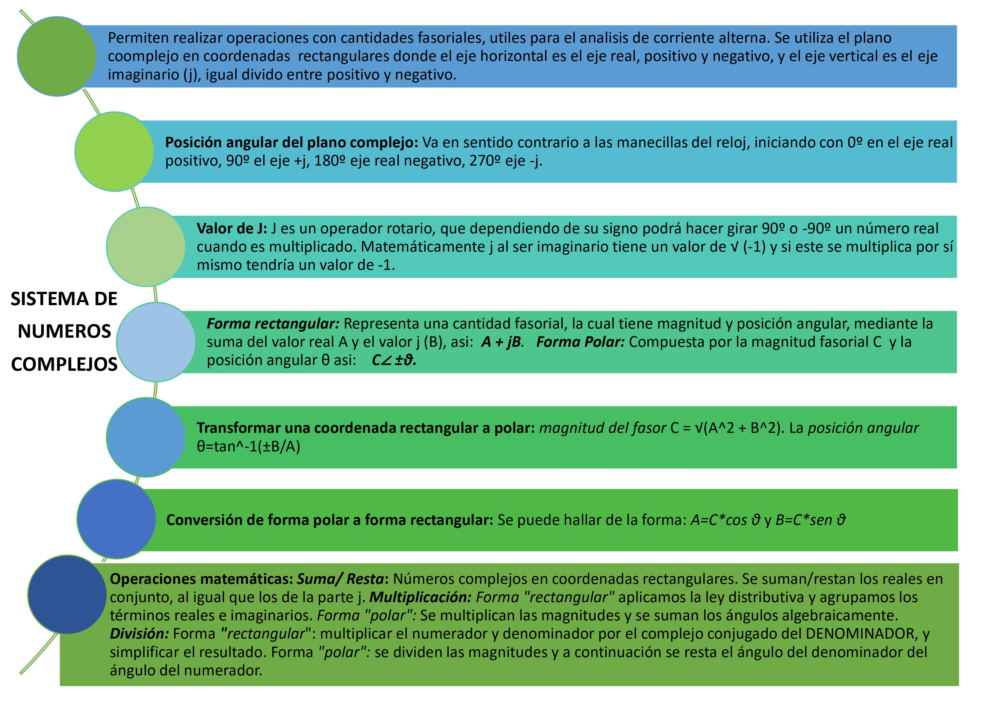

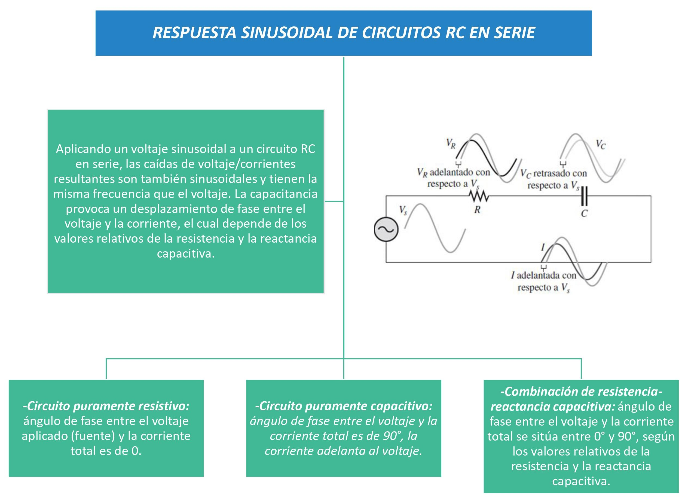

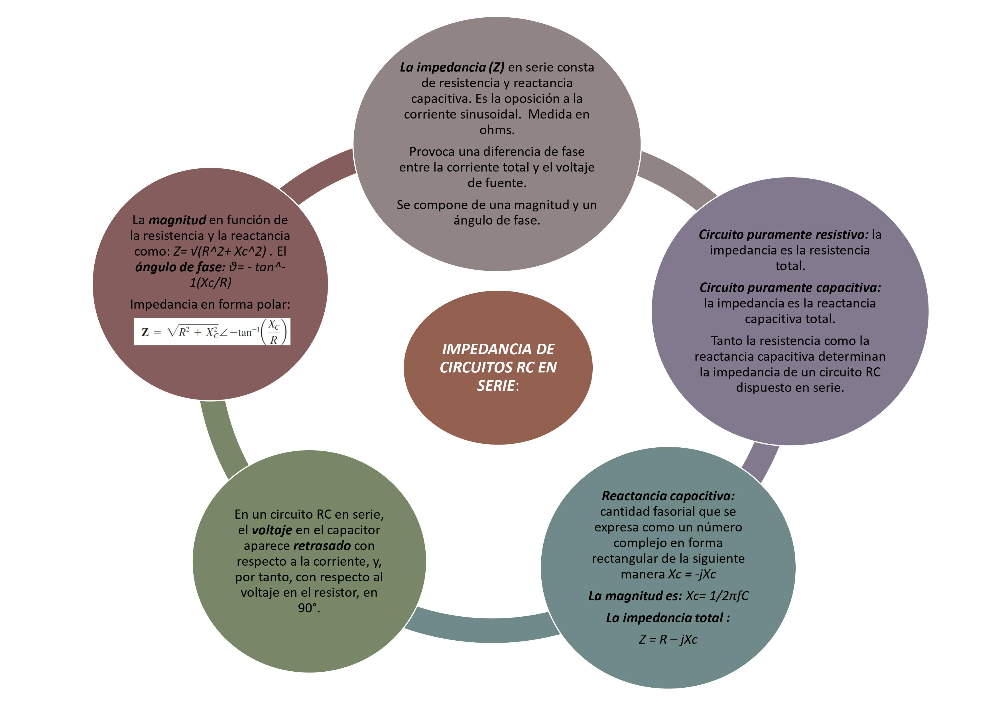

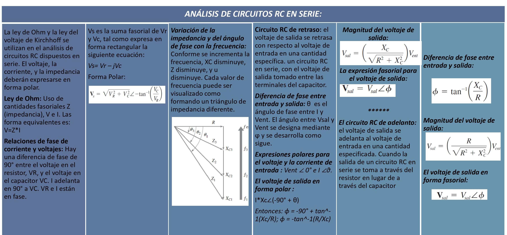

3. Diagramas

*• Sistema de Números Complejos* 

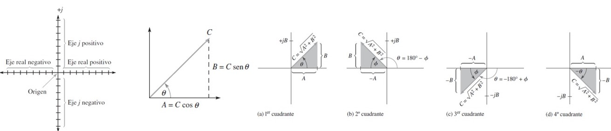

*• Respuesta Sinusoidal de circuitos Rc en serie*

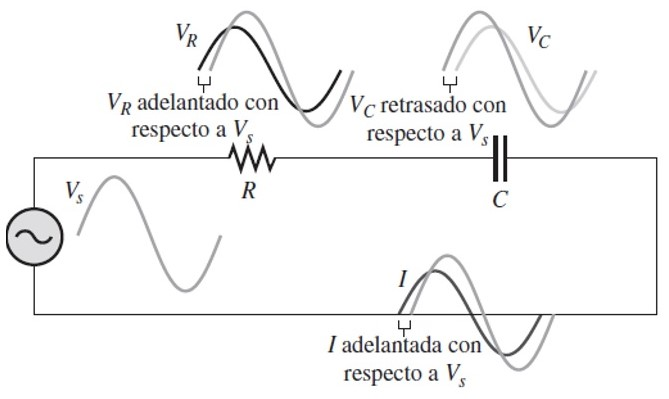

*• Impedancia de circuitos RC en serie*

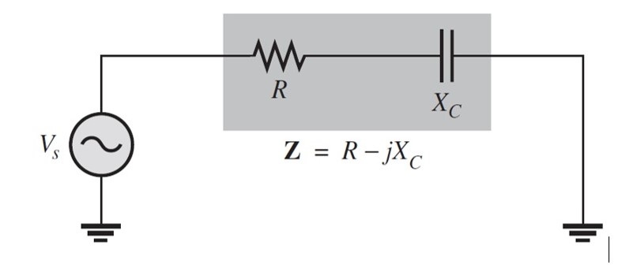

*• Análisis de circuitos RC en serie*

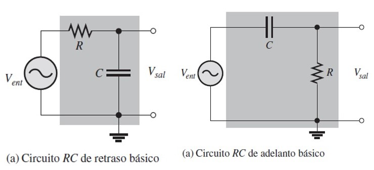

*• Aplicaciones básicas*

*• Localización de fallas*

4. Explicación

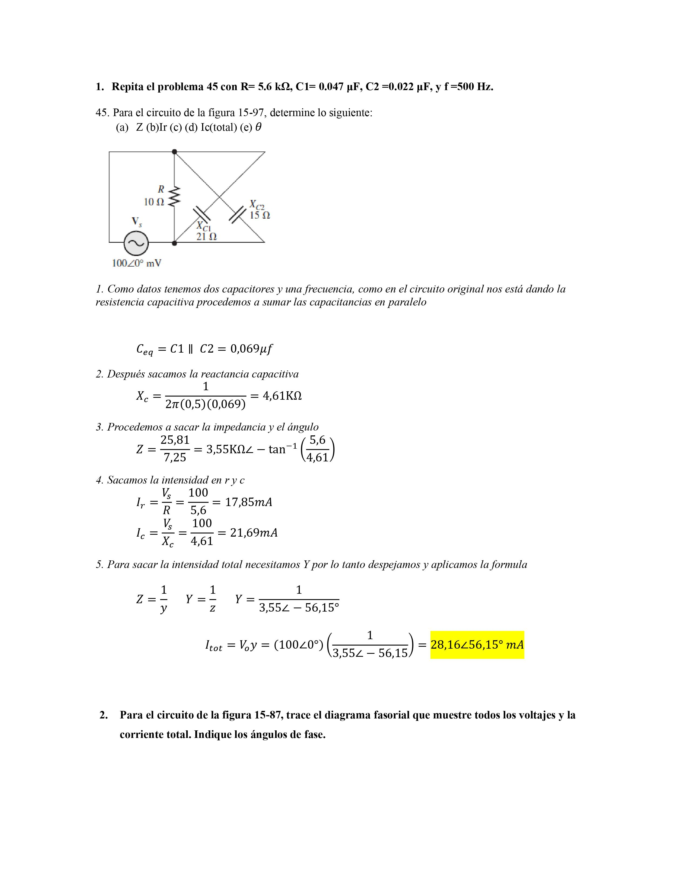

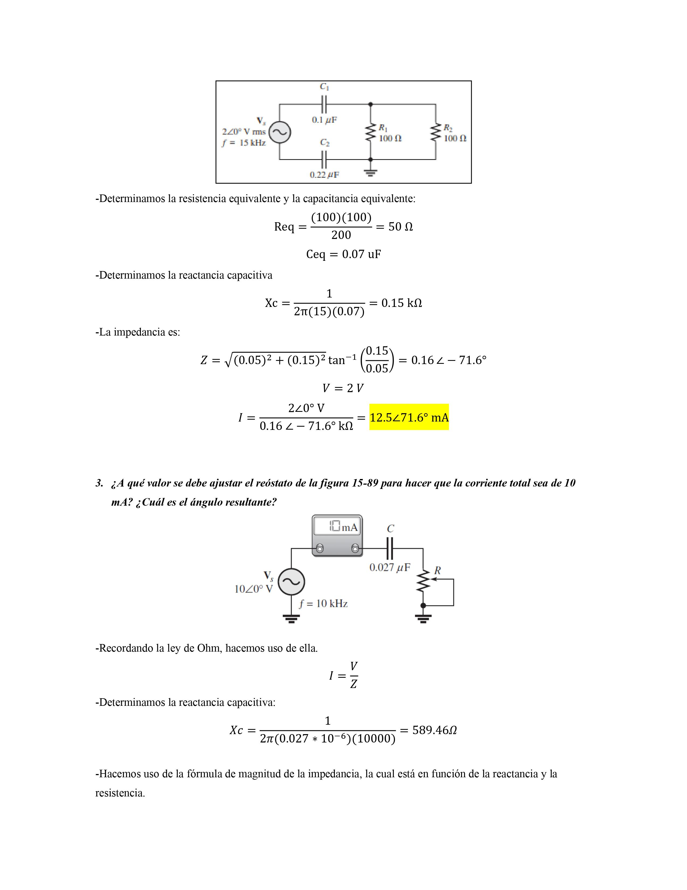

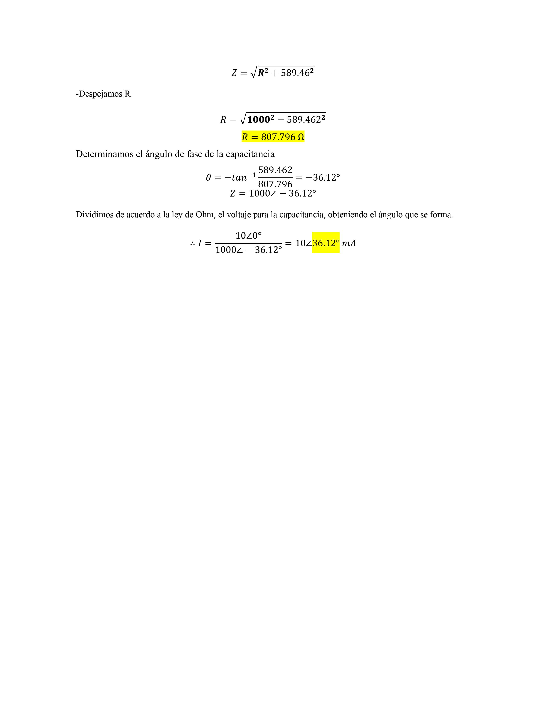

5. Conclusiones:

•	La ventaja al usar números complejos es notoria cuando podemos realizar operaciones matemáticas con cantidades fasoriales. Las cuales representan el análisis de circuitos de ca. 
• Se puede sumar, restar, multiplicar y dividir cantidades que tienen tanto magnitud como ángulo, tales como las ondas seno y otras cantidades de circuitos de ca.

•	La impedancia representa la oposición que ejerce un circuito eléctrico al paso de la corriente senoidal. La admitancia por su parte, representa lo contrario, la falta de oposición al paso de la corriente senoidal.

• Tanto la impedancia como la admitancia se pueden expresar como cantidades complejas en forma rectangular o polar, es necesario resaltar que la impedancia no es un fasor, porque no varía senoidalmente.

•	Para la resolución de estos ejercicios es fundamental el uso de conversiones de números complejos ya sea de forma rectangular a polar o de forma polar a rectangular asimismo es de vital importancia saber realizar las operaciones básicas con los mismos.

6. Bibliografía 

•	 Floyd Thomas L, “Principios de Circuitos Eléctricos”, 8 ed. 2007 .Pearson Educación de México, S.A. de C.V. México, pp. 281-333.

• Teorema de transferencia de potencia máxima. La fisica y quimica. Recuperado de: https://lafisicayquimica.com/teorema-de-transferencia-de-potencia-maxima/	

• Paralelo Circuito RLC y Análisis del circuito paralelo RLC. (s. f.). Tutoriales de electrónica básica. Recuperado 22 de febrero de 2021, de https://tutorialesdeelectronicabasica.blogspot.com/2016/06/paralelo-circuito-rlc-y-analisis-del.html

• [4]	Macías García, M. E., Contreras Hinojosa, C., Anaya Zamora, R., García, M. E. M., Hinojosa, C. C., & Zamora, R. A. Circuitos eléctricos de corriente alterna.

